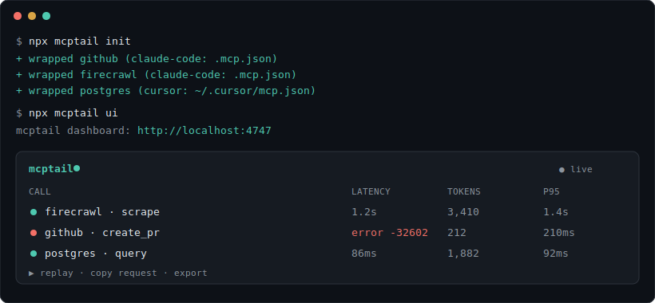

<div align="center">

# 🔍 mcptail

**See what your AI agent is actually doing. One command.**

Passive traffic capture, token attribution, and replay for MCP servers —
works with Claude Code, Cursor, and VS Code, 100% local.

[](https://github.com/Neal006/mcptail/actions/workflows/ci.yml)
[](https://www.npmjs.com/package/mcptail)
[](LICENSE)
[](CONTRIBUTING.md)



</div>

## 30-second quickstart

```bash
npx mcptail init     # wraps every MCP server in your client configs (backup kept)
# ... use Claude Code / Cursor / VS Code normally ...
npx mcptail ui       # → http://localhost:4747
```

That's it. No account, no config, nothing leaves your machine.

## Why

Everything between your MCP client and your MCP servers is invisible. When
something goes wrong, the state of the art is editing server source to add
`console.error`. So you're blind to:

- **Failures** — a tool call errors and you can't see what arguments the agent actually sent
- **Cost** — your session burns 80k tokens and you can't see which server's bloated responses ate them
- **Latency** — a call takes 30 seconds and you can't tell if it's the server or the payload
- **Behavior** — you can't audit what your agent actually did to your tools

mcptail is a transparent wiretap between the client and each server. The client
notices nothing; you see everything.

## How it works

```
Before:  Claude Code ────────────────► github MCP server
After:   Claude Code ──► [mcptail] ───► github MCP server
                            │  (byte-for-byte passthrough, never blocks, never mutates)
                            └─► ~/.mcptail/sessions/*.jsonl ──► local dashboard
```

`mcptail init` rewrites the server entries in your existing client configs to
route through `mcptail run -- <original command>`. The proxy forwards traffic
first and records on the side — if recording ever fails, it degrades to a
plain pipe rather than breaking your session. `mcptail remove` restores your
configs (a timestamped backup is also kept next to each file).

The dashboard shows every session live: a timeline of tool calls with latency
and status, request/response payloads, per-tool p50/p95 latency, and estimated
token counts per server and tool — so you can see exactly what's filling your
context window. Click any call to **replay** it against a fresh server
instance and reproduce a bug in isolation.

## Comparison

|  | mcptail | [inspector](https://github.com/modelcontextprotocol/inspector) | [MCPJam](https://github.com/MCPJam/inspector) | [mcp-shark](https://github.com/mcp-shark/mcp-shark) |
|---|---|---|---|---|
| Captures **real client traffic** passively | ✅ | ❌ sandbox | ❌ sandbox | ✅ HTTP only |
| One-command setup on existing configs | ✅ | — | — | ❌ manual gateway |
| stdio servers (how most local servers run) | ✅ | ✅ | ✅ | ❌ |
| Token attribution per server/tool | ✅ | ❌ | ❌ | ❌ |
| Replay captured calls | ✅ | ❌ | ✅ evals | ❌ |
| 100% local, no account | ✅ | ✅ | partial | ✅ |

The inspectors are great for *developing* a server in a sandbox. mcptail is for
seeing what happens in *real sessions* with your *real client*.

## Commands

```
npx mcptail init      wrap every stdio MCP server in detected client configs
npx mcptail ui        dashboard at http://localhost:4747 (--port to change)
npx mcptail doctor    check taps, configs, and recorded sessions
npx mcptail remove    unwrap everything, restoring original configs
npx mcptail run -- <command>   the wrapper itself (init injects this)
```

Supported clients: **Claude Code** (`.mcp.json`, `~/.claude.json`),
**Cursor** (`.cursor/mcp.json`, `~/.cursor/mcp.json`),
**VS Code** (`.vscode/mcp.json`). Adding a client is a
[~30-line PR](CONTRIBUTING.md#adding-a-client-adapter) — contributions welcome.

## FAQ

**Is my data safe?** Everything stays on your machine in
`~/.mcptail/sessions/`. There is no telemetry, no cloud, no account. Note that
captured sessions contain whatever your servers send — treat the directory
like logs.

**Does it slow anything down?** Traffic is forwarded before it's recorded;
the tap adds microseconds. If recording fails (full disk, whatever), mcptail
degrades to a plain pipe — your session never breaks.

**Are the token numbers exact?** They're estimates (chars/4) of how much of
your context window each payload occupies. Good for "which server is eating
my context", not for accounting.

**How do I uninstall?** `npx mcptail remove`, then delete `~/.mcptail`.

**HTTP/SSE servers?** Not yet — stdio first, since that's how most local
servers run. See the [roadmap](ROADMAP.md).

## Contributing

The codebase is small and deliberately boring — a frame splitter, a tee, a
JSONL store, and a dashboard. Good first issues are labeled
[`good first issue`](https://github.com/Neal006/mcptail/issues?q=is%3Aissue+is%3Aopen+label%3A%22good+first+issue%22);
client adapters are the easiest way in. See
[CONTRIBUTING.md](CONTRIBUTING.md).

## License

[MIT](LICENSE)
